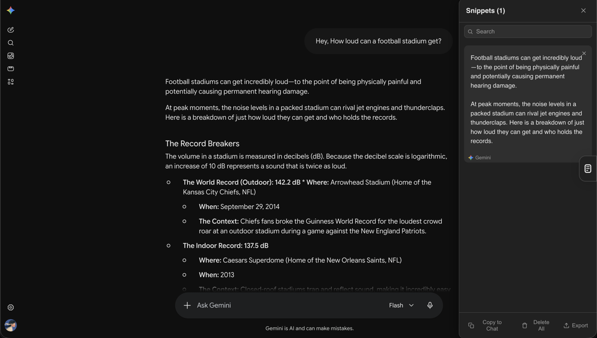

  

<h1 align="center">StackGPT</h1>

  Never lose a good chat again. Save snippets across every AI platform.

  <a href="https://github.com/lurantys/stackgpt/releases">Download for Chrome</a>
  ·
  <a href="https://github.com/lurantys/stackgpt">View on GitHub</a>

---

## Demo

  

## Features

- **Select & save** — highlight any text, click **Save snippet**, or drag it to the sidebar
- **Click to copy** — click any saved snippet to copy it to your clipboard
- **Drag to reorder** — rearrange snippets by dragging
- **Auto theme** — matches your platform's dark/light mode
- **Cross-platform** — works on ChatGPT, Claude, Gemini, and Grok
- **Shared storage** — snippets in `chrome.storage.local` are available across all platforms
- **Search & filter** — find snippets instantly

## Install

1. Go to `chrome://extensions`
2. Enable **Developer mode** (top right)
3. Click **Load unpacked** and select this folder
