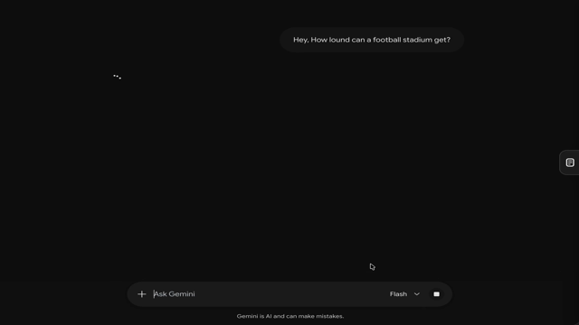

# StackGPT

Chrome extension to save text snippets from ChatGPT, Claude, Gemini, and Grok.

<video src="https://raw.githubusercontent.com/lurantys/stackgpt/main/demo.mp4" controls>
  
</video>

- Select text → click **Save snippet** or drag it to the sidebar / toggle button
- Click a snippet to copy it, drag to reorder
- Theme adapts automatically (dark/light)
- Snippets stored in `chrome.storage.local` (shared across all platforms)

## Install

1. Go to `chrome://extensions`, enable Developer mode
2. "Load unpacked" → select this folder
